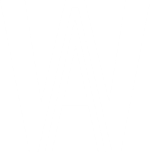

<a name="readme-top"></a>


<!-- PROJECT SHIELDS -->

[![Contributors][contributors-shield]][contributors-url]
[![Forks][forks-shield]][forks-url]
[![Stargazers][stars-shield]][stars-url]
[![Issues][issues-shield]][issues-url]
[![MIT License][license-shield]][license-url]


<!-- PROJECT LOGO -->
<br />
<div align="center">
  <a href="https://github.com/ArvidWedtstein/Nuxt-Website">
    
  </a>

  <h3 align="center">Portfolio</h3>

  <p align="center">
    Website for my portfolio
    <br />
    <a href="https://github.com/ArvidWedtstein/Nuxt-Website"><strong>Explore the docs »</strong></a>
    <br />
    <br />
    <a href="https://nuxtarvidw.netlify.app">Demo</a>
    .
    <a href="https://github.com/ArvidWedtstein/Nuxt-Website/issues">Report Bug</a>
    ·
    <a href="https://github.com/ArvidWedtstein/Nuxt-Website/issues">Request Feature</a>
  </p>
</div>


<!-- TABLE OF CONTENTS -->
<details>
  <summary>Table of Contents</summary>
  <ol>
    <li>
      <a href="#about-the-project">About The Project</a>
      <ul>
        <li><a href="#built-with">Built With</a></li>
      </ul>
    </li>
    <li>
      <a href="#getting-started">Getting Started</a>
      <ul>
        <li><a href="#prerequisites">Prerequisites</a></li>
        <li><a href="#installation">Installation</a></li>
      </ul>
    </li>
    <li><a href="#usage">Usage</a></li>
    <li><a href="#learned">What i learned</a></li>
    <li><a href="#contributing">Contributing</a></li>
    <li><a href="#license">License</a></li>
    <li><a href="#contact">Contact</a></li>
    <li><a href="#acknowledgments">Acknowledgments</a></li>
  </ol>
</details>


<!-- ABOUT THE PROJECT -->
## About The Project

[![Website Screen][product-screenshot]](https://github.com/ArvidWedtstein/Nuxt-Website)

This project started out as a school project. Later this became my portfolio. 

I chose to use Nuxt.js because i have worked with Nuxt.js at @appex before. I also wanted to learn more about Nuxt.js in general. 

I implemented Nuxt-Auth to handle authentication. 

For the backend i made a simple API with Node.js and Express.


<p align="right">(<a href="#readme-top">back to top</a>)</p>


### Built With

This project was built with:

* [![Vue][Vue.js]][Vue-url]
* [![Nuxt][Nuxt.js]][Nuxt-url]
* [![ThreeJS][Three.js]][Three-url]


<p align="right">(<a href="#readme-top">back to top</a>)</p>


<!-- GETTING STARTED -->
## Getting Started

To get started with this project you need to have node.js installed.

### Prerequisites

Update npm to the latest version
* npm
  ```sh
  npm install npm@latest -g
  ```

### Installation

1. Clone the repo
   ```sh
   git clone https://github.com/ArvidWedtstein/Nuxt-Website.git
   ```
3. Install NPM packages
   ```sh
   npm install
   ```
4. Start the project with hot reload at localhost:3000
   ```sh
    npm run dev
    ```

<p align="right">(<a href="#readme-top">back to top</a>)</p>


<!-- USAGE EXAMPLES -->
## Usage

I created this project as a place where i can show my projects and my skills.

Maybe you can use this project as inspiration for your own portfolio.


<!-- What i learned -->
## Learned

Due to the fact that this project was 4 parts out of the 6 school project we had that year i learned quite a bit. 

Some things i learned are how to use CSS (SCSS) with Nuxt.js. I also learned how to handle user authentication with the use of Nuxt-Auth and JWT.
Later that year i found out that Three.js was a thing, so i immediately became obsessed.

<p align="right">(<a href="#readme-top">back to top</a>)</p>


<!-- CONTRIBUTING -->
## Contributing

Any contributions you make are **greatly appreciated**.

If you have a suggestion that would make this better, please fork the repo and create a pull request. You can also simply open an issue with the tag "enhancement".
Sponsors are also more than greatly appreciated! :smile:

Don't forget to give the project a star! Thanks again!

1. Fork the Project
2. Create your Feature Branch (`git checkout -b feature/AmazingFeature`)
3. Commit your Changes (`git commit -m 'Add some AmazingFeature'`)
4. Push to the Branch (`git push origin feature/AmazingFeature`)
5. Open a Pull Request


<!-- LICENSE -->
## License

Distributed under the MIT License. See `LICENSE.txt` for more information.


<!-- CONTACT -->
## Contact


Project Link: [https://github.com/ArvidWedtstein/Nuxt-Website](https://github.com/ArvidWedtstein/Nuxt-Website)

<p align="right">(<a href="#readme-top">back to top</a>)</p>


<!-- ACKNOWLEDGMENTS -->
## Acknowledgments

First of all i want to thank [VictorBerland](https://github.com/victorberland) for helping me out during this project. Without him my grades would definitely be lower.

I also want to thank [Appex](https://github.com/appex) for learning me Nuxt.js


<p align="right">(<a href="#readme-top">back to top</a>)</p>


<!-- MARKDOWN LINKS & IMAGES -->
<!-- https://www.markdownguide.org/basic-syntax/#reference-style-links -->
[contributors-shield]: https://img.shields.io/github/contributors/ArvidWedtstein/Nuxt-Website.svg?style=for-the-badge
[contributors-url]: https://github.com/ArvidWedtstein/Nuxt-Website/graphs/contributors
[forks-shield]: https://img.shields.io/github/forks/ArvidWedtstein/Nuxt-Website.svg?style=for-the-badge
[forks-url]: https://github.com/ArvidWedtstein/Nuxt-Website/network/members
[stars-shield]: https://img.shields.io/github/stars/ArvidWedtstein/Nuxt-Website.svg?style=for-the-badge
[stars-url]: https://github.com/ArvidWedtstein/Nuxt-Website/stargazers
[issues-shield]: https://img.shields.io/github/issues/ArvidWedtstein/Nuxt-Website.svg?style=for-the-badge
[issues-url]: https://github.com/ArvidWedtstein/Nuxt-Website/issues
[license-shield]: https://img.shields.io/github/license/ArvidWedtstein/Nuxt-Website.svg?style=for-the-badge
[license-url]: https://github.com/ArvidWedtstein/Nuxt-Website/blob/master/LICENSE.txt
[product-screenshot]: static/images/Projects/game.PNG
[Nuxt.js]: https://img.shields.io/badge/Nuxt.js-35495E?style=for-the-badge&logo=nuxtdotjs&logoColor=4FC08D
[Nuxt-url]: https://nuxtjs.org/
[Vue.js]: https://img.shields.io/badge/Vue.js-35495E?style=for-the-badge&logo=vuedotjs&logoColor=4FC08D
[Vue-url]: https://vuejs.org/
[Three.js]: https://img.shields.io/badge/Three.js-35495E?style=for-the-badge&logo=threedotjs&logoColor=FFFFFF
[Three-url]: https://threejs.org/


